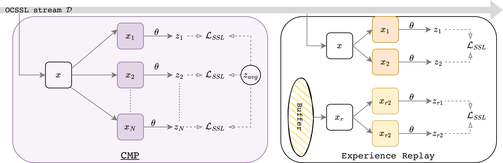

# Replay-free Online Continual Learning with Self-Supervised MultiPatches

**Giacomo Cignoni<sup>1</sup>, Andrea Cossu<sup>1</sup>, Alex Gómez Villa<sup>2</sup>, Joost van de Weijer<sup>2</sup>, Antonio Carta<sup>1</sup>**  
<sup>1</sup>University of Pisa, <sup>2</sup>Computer Vision Center (CVC)  

[](https://arxiv.org/abs/XXXX.XXXXX)  
*Accepted at ESANN 2025*

---

## Overview
This repository contains the official implementation of **Continual MultiPatches (CMP)**, a replay-free method for online continual self-supervised learning (OCSSL). CMP leverages multiple augmented views of a single input example to train robust representations without storing past data, addressing privacy and scalability challenges in continual learning.

  
*Figure 1: Comparison between CMP and Experience Replay (ER).*

---

## Abstract
Online Continual Learning (OCL) requires models to adapt to non-stationary data streams with limited computational budgets. While replay strategies are commonly used to mitigate catastrophic forgetting, they raise privacy concerns and storage limitations. We propose **Continual MultiPatches (CMP)**, a plug-in strategy for self-supervised learning (SSL) methods that generates multiple patches from a single input, projects them into a shared feature space, and avoids representation collapse via a novel loss function. CMP outperforms replay-based methods on class-incremental OCL benchmarks, challenging the role of replay as a go-to solution for self-supervised OCL.

---

## Method
CMP extends SSL frameworks (e.g., SimSiam, BYOL) by:
1. Extracting **N patches** from a single input via diverse augmentations.
2. Computing latent representations for each patch.
3. Optimizing a combined loss:  
   - **Instance Discrimination SSL Loss** (e.g., SimSiam or BYOL) to align each patch features to the average patch feature.  
   - **Total Coding Rate (TCR) Loss** to prevent feature collapse.

**Key Advantages**:  
- No replay buffer required.  
- Compatible with existing SSL models.  

---

## Results
CMP achieves state-of-the-art performance on Split CIFAR-100 and Split ImageNet100 benchmarks:

| SSL Method | Strategy        | M size | CIFAR-100          | ImageNet100        |
|------------|-----------------|--------|--------------------|--------------------|
| **EMP-SSL**| -               | 0      | 28.5 ± 0.6         | 32.7 ± 1.1         |
||||||
|            | finetuning      | 0      | 17.9 ± 0.7         | 11.7 ± 0.5         |
|            | Reservoir ER    | 500    | 29.1 ± 0.2         | 33.5 ± 0.5         |
|**SimSiam** | Reservoir ER    | 2000   | 27.6 ± 0.4         | **39.5 ± 0.5**     |
|            | FIFO ER         | 90     | 25.5 ± 0.5         | 30.0 ± 1.7         |
|            | **CMP (our)**   | 0      | **30.2 ± 0.7**     | 33.3 ± 0.7         |
||||||
|            | finetuning      | 0      | 13.3 ± 0.0         | 11.3 ± 0.2         |
|            | Reservoir ER    | 500    | 34.0 ± 0.5         | 33.9 ± 0.2         |
|  **BYOL**  | Reservoir ER    | 2000   | 32.0 ± 0.1         | 40.3 ± 0.7         |
|            | FIFO ER         | 90     | 27.6 ± 0.7         | 29.8 ± 0.8         |
|            | **CMP (our)**   | 0      | **34.6 ± 0.7**     | **46.3 ± 0.3**     |

*Top-1 linear probing accuracy (mean ± std).*

---

## Running experiments
A single experiment can be run with a simple command: `python main.py --option option_arg`. The full list of allowable commands is in the file `./src/utils.py`.

For running more structured experiments (e.g. multiple experiments with mean ± std or hyperparameter search) use `python run_from_config.py`. It needs a `config.json` file that specifies the configuration of each experiment, similar as `./config_byol_cmp_cifar100.json`, `./config_simsiam_cmp_cifar100.json`, `./config_byol_cmp_imagenet100.json` and `./config_simsiam_cmp_imagenet100.json` included in this repo.
It runs a list of experiments each with its own set of arguments; it is possible to specify common arguments for all experiments (that can be eventually overridden by each experiment). 

For each experiment desired to be run as an hyperparameter search, you need to specify inside the experiment the additional parameter `hyperparams_search`, which is supposed to be a dict of lists of the hyperparameters to try in the experiment.

For each experiment desired to be run with mean and std accuracy, you have to specify inside the experiment the additional parameter `multiple_runs`, which is supposed to be a dict with a key `seeds` corresponding to a list of seeds, one for each of the run.

---

## Citation
If you use this work, please cite:
```bibtex
@inproceedings{cignoni2024replay,
  title={Replay-free Online Continual Learning with Self-Supervised MultiPatches},
  author={Cignoni, Giacomo and Cossu, Andrea and Gómez Villa, Alex and van de Weijer, Joost and Carta, Antonio},
  booktitle={Proceedings of the ...},
  year={2025}
}
```